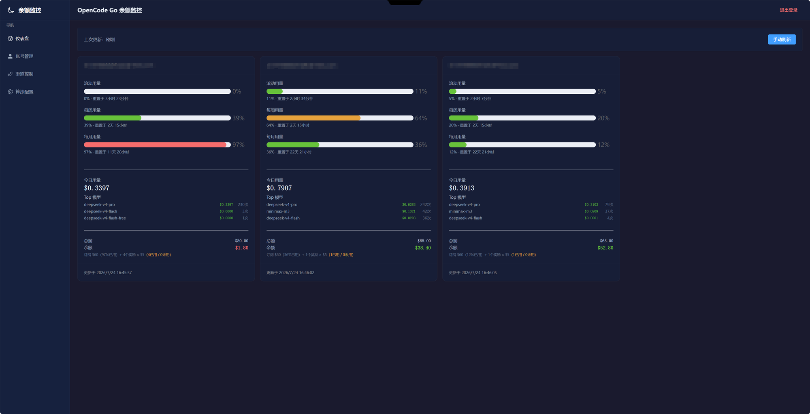
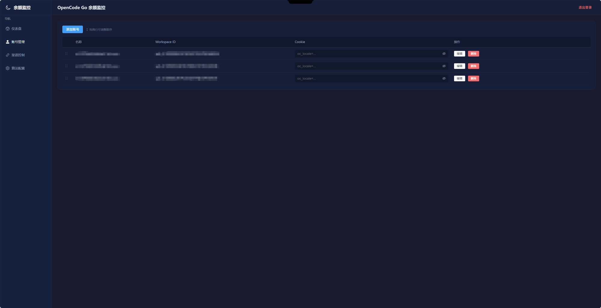

# OpenCode Go 余额监控

多账号 OpenCode Go 用量余额监控服务。通过已有 cookie 登录，后台定时轮询并自动翻页抓取全量数据，网页仪表盘集中展示。

## 功能

- **多账号管理** — 支持添加多个 OpenCode Go 账号，独立查询互不干扰
- **用量仪表盘** — 滚动 / 每周 / 每月用量百分比 + 实时重置倒计时
- **余额展示** — 订阅余额 + 邀请奖励余额实时计算
- **每日用量** — 当日 API 花费总额（自动翻页全量抓取）+ Top 5 模型用量排行
- **拖拽排序** — 账号管理页拖拽调整展示顺序，仪表盘同步
- **后台轮询** — 每 5 分钟自动抓取最新数据
- **简单认证** — 密码登录保护（JWT）
- **响应式设计** — 手机 / 平板 / 桌面全适配
- **暗色主题** — Element Plus 暗色主题，数据一目了然
- **Docker 部署** — 一键 `docker compose up -d`

## 截图




## 快速开始

### 环境要求

- Node.js 18+
- npm 9+

### 从 Git 拉取

```bash
git clone https://gitee.com/zxl000/opencode-balance.git
cd opencode-balance
```

### 1. 安装依赖

```bash
# 根目录（后端依赖）
npm install

# 前端依赖
cd client && npm install && cd ..
```

### 2. 配置环境变量

```bash
cp .env.example .env
```

编辑 `.env`：

```env
PORT=3456                       # 服务端口
APP_PASSWORD=admin123           # 登录密码，生产环境务必修改
JWT_SECRET=change-me-in-production  # JWT 签名密钥，务必修改
POLL_INTERVAL_MINUTES=5         # 后台轮询间隔（分钟）
```

### 3. 本地开发启动

**后端**（端口 3456）：

```bash
npm start
```

**前端开发服务器**（端口 5173，自动代理 API）：

```bash
cd client && npm run dev
```

访问 http://localhost:5173

### 4. 生产构建

前端构建后由后端直接提供静态文件：

```bash
cd client && npm run build && cd ..
npm start
```

访问 http://localhost:3456

## Docker 部署

### docker-compose（推荐）

```bash
docker compose up -d
```

服务运行在 http://localhost:3456

**数据持久化**：`data/` 目录挂载到容器，数据库文件自动保存。

**修改端口**：编辑 `docker-compose.yml`：

```yaml
ports:
  - "5777:3456"    # 宿主机端口:容器端口
```

### 手动构建

```bash
docker build -t opencode-balance .
docker run -d -p 3456:3456 -v ./data:/app/data opencode-balance
```

### 更新

```bash
docker compose down
docker compose build --no-cache
docker compose up -d
```

## 使用说明

### 获取 Cookie

1. 浏览器登录 https://opencode.ai
2. 按 F12 打开 DevTools → Application → Cookies
3. 复制 `auth` cookie 的完整值（以 `Fe26.2**` 开头）
4. 也可以直接复制整个 Cookie 字符串（包含 `oc_locale=zh; auth=Fe26.2**...`，系统会自动识别）

### 获取 Workspace ID

1. 在 OpenCode 网站点击 "GO" 进入用量页面
2. 地址栏 URL 格式：`https://opencode.ai/workspace/{WORKSPACE_ID}/go`
3. 复制 `wrk_` 开头的那段

### 添加账号

1. 访问管理页 `http://localhost:3456/accounts`
2. 点击"添加账号"
3. 填入名称、Workspace ID、Auth Cookie
4. 保存后后台自动开始轮询

### 查看用量

1. 访问仪表盘 `http://localhost:3456/`
2. 每张卡片显示：
   - 滚动用量（5 小时窗口）
   - 每周用量
   - 每月用量
   - 今日 API 花费 + Top 5 模型
   - 余额（订阅 + 邀请奖励）
3. 点击"手动刷新"立即抓取最新数据

## 环境变量

| 变量 | 默认值 | 说明 |
|------|--------|------|
| `PORT` | `3456` | 服务端口 |
| `APP_PASSWORD` | `admin123` | 登录密码 |
| `JWT_SECRET` | `change-me-in-production` | JWT 签名密钥，生产环境务必修改 |
| `POLL_INTERVAL_MINUTES` | `5` | 后台轮询间隔（分钟） |

## 技术栈

- **后端**：Node.js + Express + sql.js (WebAssembly SQLite)
- **前端**：Vue 3 + Vite + Element Plus + Vue Router
- **认证**：JWT (jsonwebtoken)
- **部署**：Docker + docker-compose

## 项目结构

```
opencode-balance/
├── server/                    # Express 后端
│   ├── index.js               # 入口
│   ├── db.js                  # SQLite 数据库层
│   ├── scraper.js             # OpenCode 页面抓取（自动翻页）
│   ├── logger.js              # 日志
│   ├── middleware/
│   │   └── auth.js            # JWT 认证中间件
│   └── routes/
│       ├── auth.js            # 登录 API
│       ├── accounts.js        # 账号 CRUD API
│       └── usage.js           # 用量查询 API + 后台轮询
├── client/                    # Vue 3 前端
│   ├── src/
│   │   ├── App.vue            # 布局
│   │   ├── main.js            # 入口
│   │   ├── router/            # 路由 + 登录守卫
│   │   ├── api/               # Axios 封装
│   │   ├── utils/             # 工具函数
│   │   └── views/
│   │       ├── Login.vue      # 登录页
│   │       ├── Dashboard.vue  # 仪表盘
│   │       └── Accounts.vue   # 账号管理
│   └── vite.config.js         # Vite 配置（API 代理）
├── data/                      # SQLite 数据目录（Docker 挂载点）
├── Dockerfile                 # Docker 构建文件
├── docker-compose.yml         # Docker Compose 配置
├── .env.example               # 环境变量模板
└── README.md
```

## 常见问题

### 用量数据显示"暂无今日数据"

等待后台轮询（默认 5 分钟），或点击"手动刷新"按钮。

### 显示"认证过期"

Auth Cookie 已失效，需要重新从浏览器获取。OpenCode 的 cookie 有效期通常为 30 天。

### 月用量和滚动用量显示一样

旧版本 bug，已修复。更新到最新代码即可。

### 每日用量金额不准

系统会自动翻页抓取全量当日数据。如果金额差异较大，可能是某些页面的 `x-server-id` 发生了变化（OpenCode 部署更新时会变），需要从浏览器重新获取。

### 如何修改密码

编辑 `.env` 中的 `APP_PASSWORD`，重启服务。

---

# OpenCode Go Balance Monitor（English）

A multi-account OpenCode Go usage and balance monitoring service with auto-pagination and web dashboard.

## Features

- **Multi-account** — Multiple OpenCode Go accounts with isolated queries
- **Dashboard** — Rolling / Weekly / Monthly usage + countdown
- **Balance** — Subscription + invitation reward balance
- **Daily Usage** — Total daily cost with auto-pagination + Top 5 models
- **Drag & Drop** — Reorder accounts
- **Auth** — JWT password login
- **Responsive** — Mobile / Tablet / Desktop
- **Dark Theme** — Element Plus dark mode
- **Docker** — One-command deployment

## Quick Start

```bash
git clone https://gitee.com/zxl000/opencode-balance.git
cd opencode-balance
npm install && cd client && npm install && cd ..
cp .env.example .env

# Development
npm start                    # Backend :3456
cd client && npm run dev     # Frontend dev :5173

# Production
cd client && npm run build && cd ..
npm start                    # :3456

# Docker
docker compose up -d
```

## Environment Variables

| Variable | Default | Description |
|------|--------|------|
| `PORT` | `3456` | Server port |
| `APP_PASSWORD` | `admin123` | Login password |
| `JWT_SECRET` | `change-me-in-production` | JWT signing secret |
| `POLL_INTERVAL_MINUTES` | `5` | Polling interval |

## Tech Stack

- **Backend**: Node.js + Express + sql.js (SQLite)
- **Frontend**: Vue 3 + Vite + Element Plus
- **Deploy**: Docker + docker-compose

---

# OpenCode Go 餘額監控（繁體中文）

多帳號 OpenCode Go 用量餘額監控服務，支援自動翻頁全量抓取。

## 功能

- **多帳號管理** — 多個 OpenCode Go 帳號獨立查詢
- **儀表板** — 滾動 / 每週 / 每月用量 + 倒數計時
- **餘額** — 訂閱 + 邀請獎勵餘額計算
- **每日用量** — 自動翻頁抓取 + Top 5 模型排行
- **拖曳排序** — 調整帳號順序
- **認證** — JWT 密碼登入
- **響應式** — 手機 / 平板 / 桌面適配
- **暗色主題** — Element Plus 暗色模式
- **Docker** — 一鍵部署

## 快速開始

```bash
git clone https://gitee.com/zxl000/opencode-balance.git
cd opencode-balance
npm install && cd client && npm install && cd ..
cp .env.example .env
npm start
```

## 環境變數

| 變數 | 預設值 | 說明 |
|------|--------|------|
| `PORT` | `3456` | 服務埠號 |
| `APP_PASSWORD` | `admin123` | 登入密碼 |
| `JWT_SECRET` | `change-me-in-production` | JWT 金鑰 |
| `POLL_INTERVAL_MINUTES` | `5` | 輪詢間隔 |

## 技術棧

- **後端**：Node.js + Express + sql.js (SQLite)
- **前端**：Vue 3 + Vite + Element Plus
- **部署**：Docker + docker-compose
